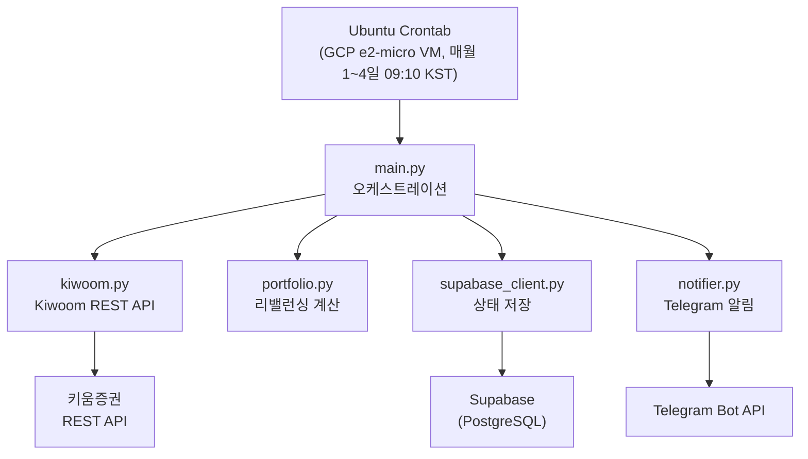
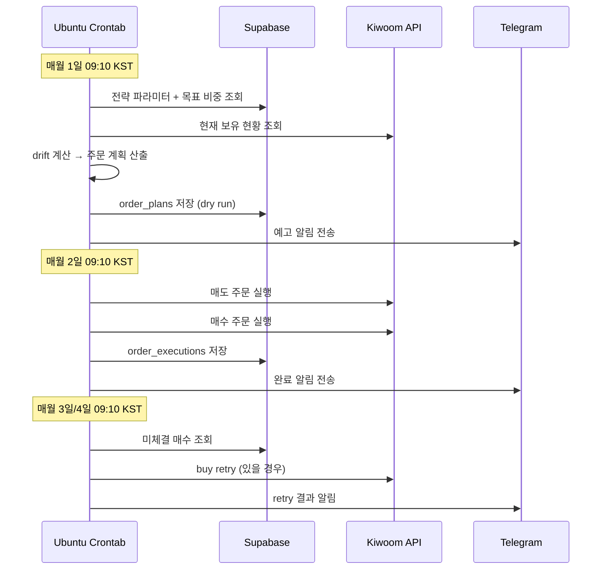

# Kiwoom Portfolio Trader

키움증권 REST API를 사용한 ETF 포트폴리오 자동 리밸런싱 시스템.

GCP free tier VM에서 Ubuntu crontab으로 매월 1일부터 4일까지 자동 실행된다 (Day 1: dry-run, Day 2: 주문, Day 3/4: buy retry). Supabase에 상태를 저장하고 Telegram으로 알림을 보낸다.

---

## 한 줄 요약

> 매월 자동으로 ETF 포트폴리오를 목표 비중에 맞게 리밸런싱하는 시스템

---

## 아키텍처



---

## 월간 실행 흐름



---

## 빠른 시작 (에이전트와 함께)

이 프로젝트는 **AI 에이전트가 처음부터 끝까지 구현을 도와주도록 설계**되어 있습니다.  
개발 경험이 없어도 에이전트와 대화하면서 완성할 수 있습니다.

**에이전트에게 이렇게 말하세요:**
```
docs/step-01-project-init.md 부터 순서대로 구현해줘.
AGENTS.md의 지침을 따르고, ⏸️ USER ACTION이 나오면 안내해줘.
```

---

## Step 진행 순서

| Step | 문서 | 핵심 산출물 | 사용자 입력 |
|------|------|------------|:-----------:|
| 1 | [step-01-project-init.md](docs/step-01-project-init.md) | `pyproject.toml`, 디렉토리 구조 | ❌ |
| 2 | [step-02-supabase-schema.md](docs/step-02-supabase-schema.md) | 5개 테이블 DDL | ⏸️ |
| 3 | [step-03-kiwoom-client.md](docs/step-03-kiwoom-client.md) | `src/trader/kiwoom.py` | ⏸️ |
| 4 | [step-04-rebalancing-logic.md](docs/step-04-rebalancing-logic.md) | `src/trader/portfolio.py` | ❌ |
| 5 | [step-05-gcp-cron.md](docs/step-05-gcp-cron.md) | `scripts/run_rebalance.sh`, crontab | ⏸️ |
| 6 | [step-06-telegram-notifier.md](docs/step-06-telegram-notifier.md) | `src/trader/notifier.py` | ⏸️ |
| 7 | [step-07-main-entry.md](docs/step-07-main-entry.md) | `src/trader/main.py` | ❌ |

---

## 외부 서비스 목록

| 서비스 | 용도 | 무료 여부 |
|--------|------|:---------:|
| [키움증권 Open API+](https://openapi.kiwoom.com/) | ETF 매매 | ✅ (모의투자) |
| [Supabase](https://supabase.com/) | 데이터 저장 | ✅ (Free tier) |
| Telegram Bot | 알림 전송 | ✅ |
| GCP e2-micro VM | cron 실행 (고정 IP) | ✅ (Free tier) |

---

## 참고 문서

- [수동 리밸런싱 & 복구 가이드](docs/rollback.md) — 실패 시 직접 처리하는 방법
- [scripts/verify_step.py](scripts/verify_step.py) — 각 Step 완료 조건 자동 검증

```bash
# Step 검증 예시
uv run python scripts/verify_step.py 1
uv run python scripts/verify_step.py all
```

---

## 기술 스택

| 영역 | 선택 |
|------|------|
| 언어 | Python 3.12+ |
| 패키지 관리 | uv |
| Kiwoom 클라이언트 | [kiwoompy](https://meonji-gogo.github.io/kiwoompy/) |
| DB | Supabase (PostgreSQL) |
| 알림 | Telegram Bot API |
| CI/CD | GCP VM + Ubuntu crontab |
| 린터/포매터 | ruff |
| 테스트 | pytest |
